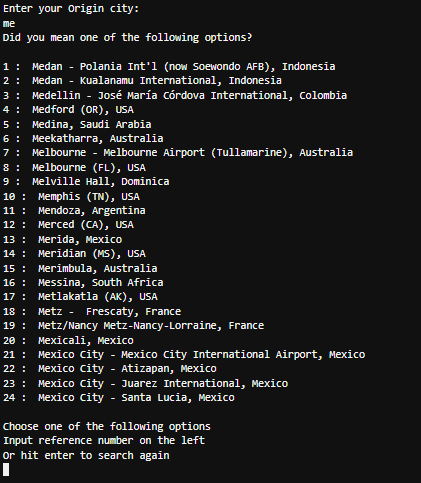
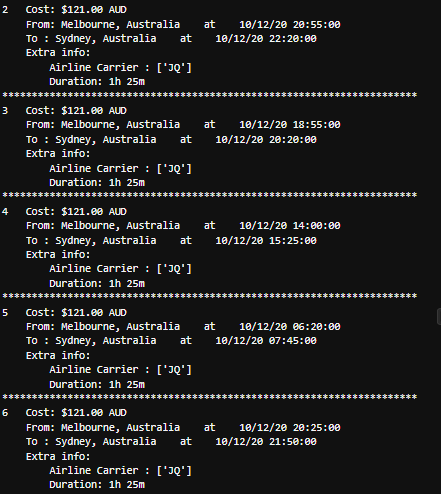
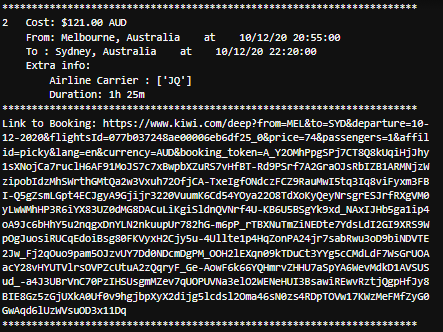
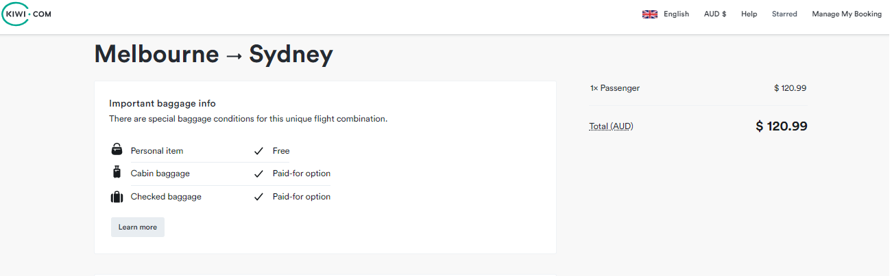
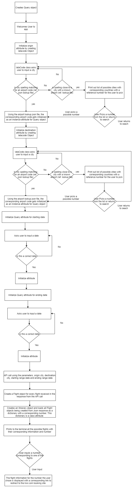
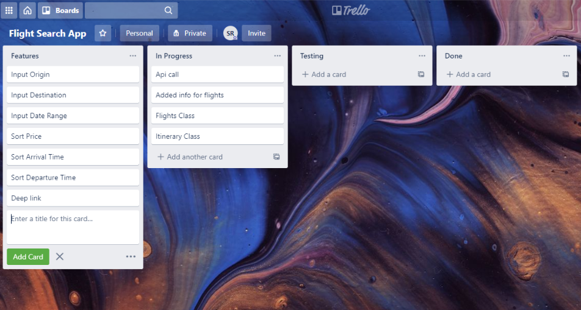
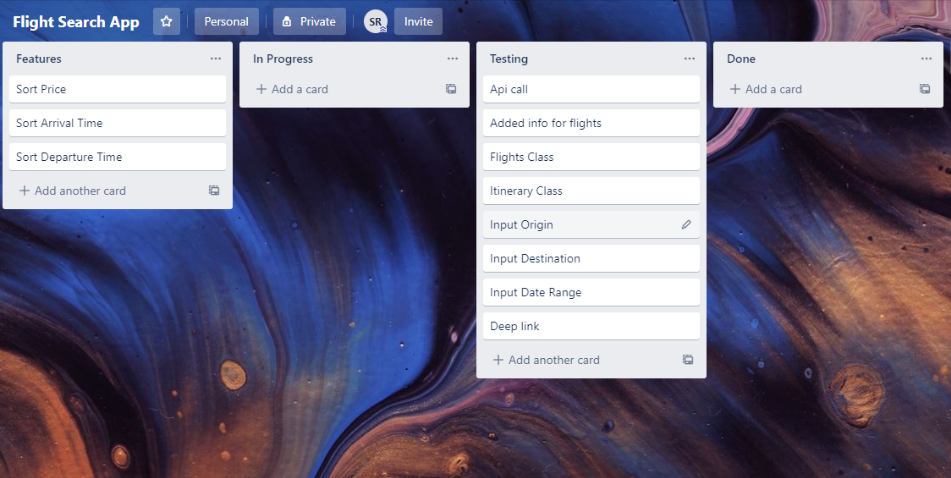
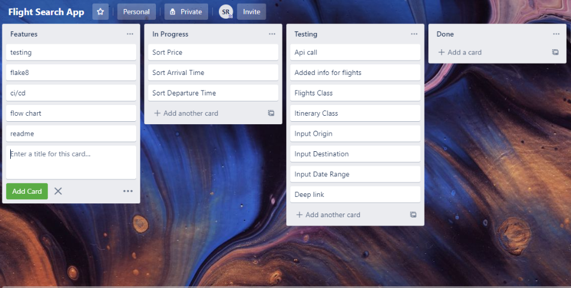
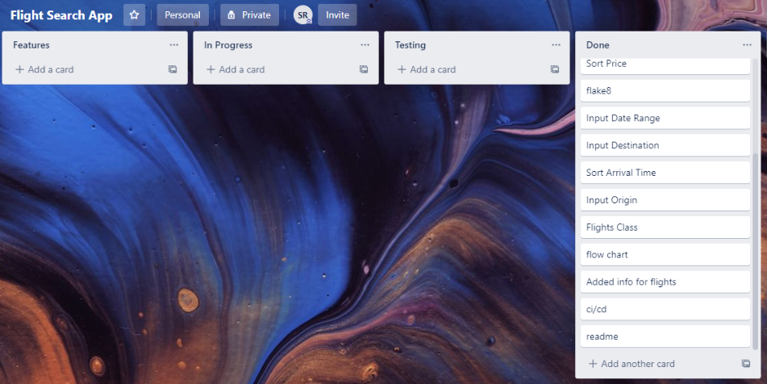

# Flight Search

## Purpose
I created this application for anyone wanting to book a flight. The algorithm was developed to take inputs from a user, uses error handling to format the inputs in such a way that the program can communicate with the skypicker API to make a GET request with these inputs as parameters. The user can then pick one of the flights from the response and receive a deep link that will take you directly to the booking page for that flight.

## Installing

##### For the App,

1. Create a directory to clone the git repo into
2. Clone git repo
3. If not running python 3.8, run the following bash commands
    1. `sudo apt update`
    2. `sudo apt install python3.8`
4. Create a virtual enviornment
    1. `sudo apt-get install python3-pip`
    2. `sudo apt-get install python3-venv`
    3. `python3 -m venv venv`
    4. `python source venv/bin/activate`
5. Install the modules in requirements.txt
    1. `pip install -r requirements.txt`
6. Run the Program
    1. `python main.py`

## Applying Solution

The API call requires the following parameters:

- Origin airport code
- Destination airport code
- Starting Range date
- Ending Range date

The program starts by instantiating a Query object. The Query class has instance attributes corresponding to the parameters of the api call and these are initialized when the object is created. The API call itself will also be an attribute initialized when the query object is created but this will occur last, after initializing the parameters needed.

For the airport code attributes, the Query object will create an object from the IataCode class with a prompt either for the origin or destination city. The Query class will need both. 

The IataCode object when created will prompt the user to input a city name (prompt is depending on which attribute the Query is initialising). The algorithm then searches through a reference Json file I created that checks over every city that has an airport code. If the city is found with the correct spelling, the corresponding airport code (found in the same Json file) is returned to the Query object as it's attribute.

If the spelling is incorrect the program will create a dictionary with numbers as keys. The corresponding values are the possible options of cities (and the country they are located in) with similar spellling (this is found in the same Json file) and it is checked against the first four letters of the user's input (or all options if user's input is less than 4 letters). 
```
    def multiple_options(self, city: str) -> dict:
        options = {}
        count = 1
        for cities in self.all_iata_codes:
            if (len(city) < 4) and (city == cities[:len(city)]):
                options[count] = [cities, self.all_iata_codes[cities]]
                count += 1
            else:
                if cities[:4] == city[:4]:
                    options[count] = [cities, self.all_iata_codes[cities]]
                    count += 1
        return options
```

The dictionary is then printed to the screen in an easily readable way for the user. 



The user will be prompted to input a corresponding number for the city they would like. If the number is listed, the corresponding airport code for that city will be returned to the Query object as it's airport code attribute, otherwise the user will be asked to search again. If the spelling doesn't closely match any city, the user will be prompted to try searching again.

The process is first for the Query's origin attribute but then repeated to obtain the Query's destination attribue.

Returning to the Query object, it will then need to initialize the date attributes. The user will be prompted to enter a date. The API call returns flights available between a range of dates so the user will need to input a date for the beginning and ending of the range they request. The parameter needed for the API call requires the date be of the format dd/mm/yyyy. The user will be reminded this. The algorithm will then use error handling to make sure integers we're inputed and using the datetime module, will check if the date is a real date (for example the user did not input month 20 in their input). If any of these errors occur the algorithm will remind the user of the format and ask again.

```
        except ValueError:
            print("""Sorry can you try that again
(remember format is dd/mm/yyyy)""")
            return self.get_date(question)
```

This process will occur twice, once for the starting range date and one for the ending range date and will be the Query object's starting and end ending range date attribute.

Now that the Query object initialized it's first 4 attributes corredsponding to all the parameters obtained from the user. The algorithm will communicate with the skypicker API. It will do this by making a get requests will the Query's instance attributes. The response obtained will be a single Json that the program will parse, it will create a Flight object for every flight returned from the API. This object will be instantiated with the following attributes

```
class Flight():
    def __init__(self, flight_data: dict) -> None:
        self.flight_data = flight_data
        self.origin_city = self.strip_info("cityFrom")
        self.origin_country = self.strip_info("countryFrom")["name"]
        self.origin = f"{self.origin_city}, {self.origin_country}"
        self.dest_city = self.strip_info("cityTo")
        self.dest_country = self.strip_info("countryTo")["name"]
        self.destination = f"{self.dest_city}, {self.dest_country}"
        self.price = self.convert_to_price(self.strip_info("price"))
        self.departure_time_UTC = self.strip_info("dTimeUTC")
        self.departure_time = self.convert_timestamp(self.departure_time_UTC)
        self.arrival_time_UTC = self.strip_info("aTimeUTC")
        self.arrival_time = self.convert_timestamp(self.arrival_time_UTC)
        self.deep_link = self.strip_info("deep_link")
        self.duration = self.strip_info("fly_duration")
        self.airlines = self.strip_info("airlines")
```

These are the atttributes that I found are relevant to people when searching for a flight.

As the Flight objects are created (for each flight in the response from the API call) they are immediately added to a new Itinerary object. This class has an empty dictionary and a count to keep track of the flights. This dictionary has a number from the count as a key and the flight object as the value. 

```
for flights in new_query.query_results:
    Itinerary.add_flight(Flight(flights))
```
```
class Itinerary():
    itineraries = {}
    count = 1

    @classmethod
    def add_flight(cls, flight: Flight) -> None:
        cls.itineraries[cls.count] = flight
        cls.count += 1
```

The algorithm then formats the information in an easily readable way for the user and prints this to the screen. This shows off all the relevant flight information as well as the number value refernce.



The user then pick an option from the ones that are displayed by inputting the orresponding number. This number is the key vaue for the flight object in the dictionary we created as a class attribute for the Itinierary object. When the User selects an option it will be printed out to the screen with a deep link corresponding to that flight.



This link will then direct the user to the kiwi.com booking site for all the relevant information.



## Flowchart



## Testing

This application has automated tests created by me and can be found in the test folder in src.

There is a test module for the individual modules other than main.py.


## CI/CD Pipeline

There is a CI/CD Pipeline that uses github actions. This pipeline goes through all my tests to make sure any new code doesn't break any code for continuous integration.

For the continuous deployment, my workflow deploys the code onto an ec2 instance. It removes the old code base and clones the repo on the instance to have the current code.


## Things to Note

The kiwi.com API is a free service, therefore before booking any flights, the details should be double checked before finalizing (once you've reached the booking page).

## Process




.PNG)


## Hope You Enjoy!
